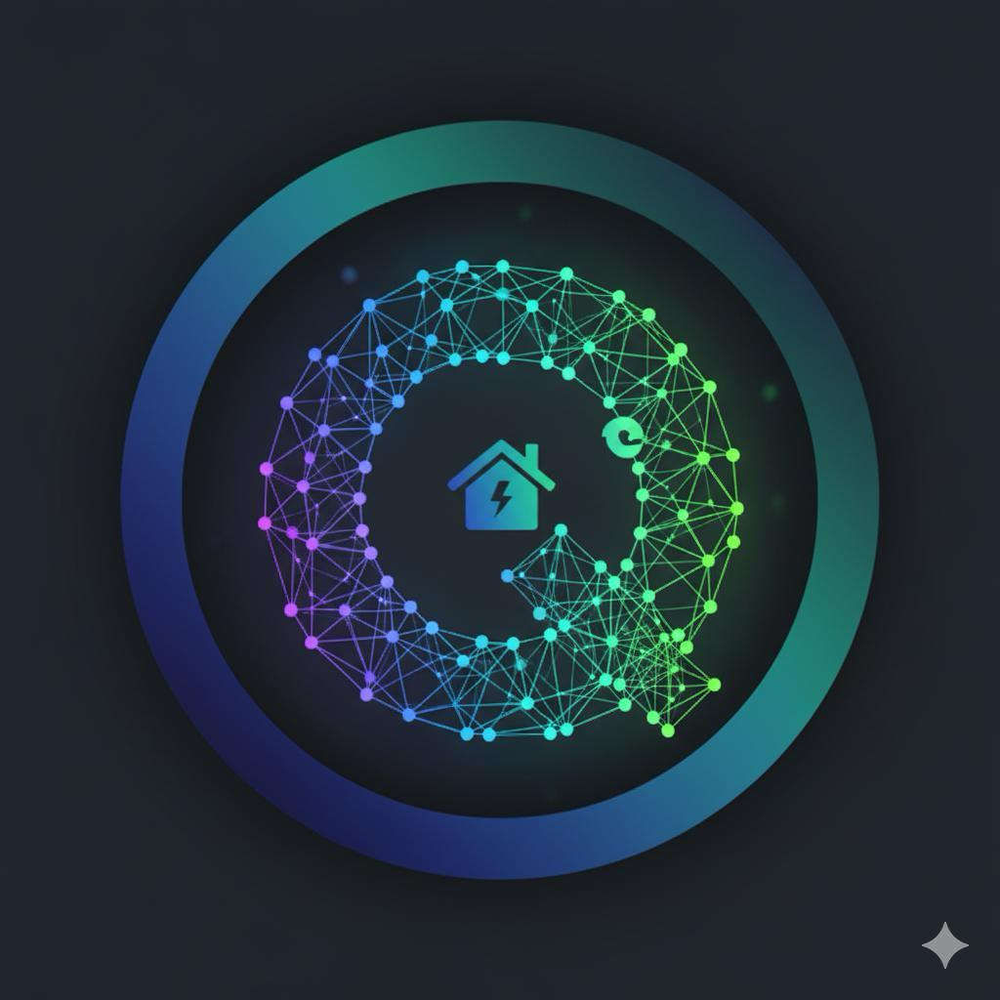

# Huawei-Hackathon-2025

**QuIEP — Quantum-Intelligent Energy Platform**  
ORCA Quantum Blockchain for Hyper-Secure P2P Solar Energy Trading
QuIEP (Quiet) Energy Trading, Quantum Control

**Track:** Society, Sustainability & Digital Transformation  

<div align="center">
  
  <h3>AI Forecast  + Q-ORCA Blockchain  + Solar Map API </h3>
  <p>Empowering communities to forecast, trade, and trust clean solar energy — built for the Huawei Tech4City Hackathon 2025.</p>
  <a href="About the project">About the project</a> •
  <a href="#architecture">Architecture</a> •
  <a href="#Why Huawei ">Why Huawei </a> •
  <a href="#references">References</a>
</div>

---

##  About the Project  

**QuIEP** is a prototype that reimagines *clean energy democratization* through three integrated layers:  
1️⃣ **AI Forecast System (Huawei-powered)** — predicts solar generation using *pvlib* + *LightGBM* with Huawei cloud AI services for optimization.  
2️⃣ **Q-ORCA Quantum Blockchain** — enables secure one-to-many broadcasts for energy trading and alerts with *quantum-randomized encryption*.  
3️⃣ **Solar Map API** — visualizes rooftop solar potential using Google Solar API and real-time irradiance datasets.  

QuIEP aims to make distributed energy accessible, transparent, and trustworthy for every household — combining **AI foresight** with **quantum-secured trust**.

---

##  AI Forecast System  

**Engine:** `pvlib` + `LightGBM` + Huawei AI ModelArts simulation  

- Simulates irradiance, shading, temperature & module efficiency.  
- Huawei’s **Digital Power** and **ModelArts** cloud stack can host the forecasting model for scalable inference.  
- Integrated with **Huawei Larr** (Learning, Analytics & Renewable Resource) to align predictions with grid-level energy balance.  
- Delivers a **generation forecast** and **confidence index** directly into the blockchain for transparent sharing.  

**Formula (simplified):**
P_out = (G_poa * η_module * (1 - γΔT)) * inverter_efficiency

where *G_poa* = plane-of-array irradiance (from pvlib) and *γ* is temperature coefficient.

---

## Q-ORCA Quantum Blockchain  

**Goal:** trustable, efficient communication between multiple energy nodes.  

- Built with **Orthogonal Recursive Covert Algorithm (ORCA)** on top of a **Huawei BCS-compatible blockchain**.  
- Uses **Hadamard-matrix encoding** to send *one encrypted broadcast to many recipients*.  
- Reduces encryption/signing operations from `O(N)` → `O(1)`, saving ~80–90 % network bandwidth compared to traditional broadcast.  
- Integrated **Quantum Random Number Generator (QRNG)** & **QKD-style session keys** to ensure entropy integrity and tamper resistance.  
- Every energy transaction carries an *AI forecast + quantum trust token*, verified across the network.  

**Benefits**
- Efficient & scalable P2P communication for solar communities.  
- Hidden (covert) communication channel → security without revealing sender identity.  
- Lightweight enough for edge IoT gateways (home inverters, microgrids).

---

##  Theory Behind  

| Layer | Concept | Advantage |
|-------|----------|-----------|
| **AI Forecast** | pvlib + LightGBM on Huawei Cloud | Robust, explainable solar prediction |
| **Blockchain** | Q-ORCA orthogonal encoding + quantum entropy | Secure, one-to-many covert data flow |
| **Integration** | Smart contracts + ORCA mapping | Automated energy pricing, carbon credit tokenization |

**Mathematical Core:**  
Hadamard encoding \( H_n = [H_{n/2}, H_{n/2}; H_{n/2}, -H_{n/2}] \) enables lossless decoding by each node using its assigned vector.  

---

##  Architecture  

```text
[Frontend Web / Mobile App]
      |
    [API Gateway (APIG)]
      |
   +----------------------------+
   |  ServiceStage Microservices |
   |  - Forecast Engine (pvlib + AI) |
   |  - Trading Engine (ORCA-Blockchain) |
   |  - Solar Map (Google API) |
   +----------------------------+
      |
    [Huawei Cloud BCS + Redis + DMS]
      |
   [Quantum Encryption Layer (QRNG + ORCA)]
```
##  Why Huawei  

| **Huawei Service** | **Role** |
|--------------------|----------|
| **ModelArts / Pangu AI** | Train & deploy solar forecasting models |
| **BCS (Blockchain Service)** | Host ORCA-based smart contracts |
| **APIG / ServiceStage** | Manage microservices and APIs |
| **CPT / WAF / Anti-DDoS** | Security, performance and stress testing |
| **Digital Power Platform** | Hardware integration for smart inverters |

Even though **QuIEP** runs on open-source technologies (pvlib, LightGBM, Python), it is **architected for native integration** with **Huawei Cloud Digital Power** and **Larr Renewable Optimization Frameworks**, ensuring scalability, interoperability, and real-world industrial readiness.

---

##  Getting Started  

###  Prerequisites  
- Python 3.10 +  
- `pvlib`, `lightgbm`, `numpy`, `matplotlib`  
- Optional: **Huawei ModelArts** account (for AI hosting and model deployment)  
- Valid **Google Solar API** key  

### ⚙️ Installation  

```bash
git clone https://github.com/YourUser/Huawei-Hackathon-2025.git
cd Huawei-Hackathon-2025
pip install -r requirements.txt
```

## References
- Huawei Digital Power White Paper 2025
- Wang et al., 2025: “From one-one to one-many: ORCA enables scalable and revocable group covert communication on blockchain.”
- DNV Energy Transition Outlook 2025: P2P Trading & Smart Microgrids.
- pvlib Documentation
